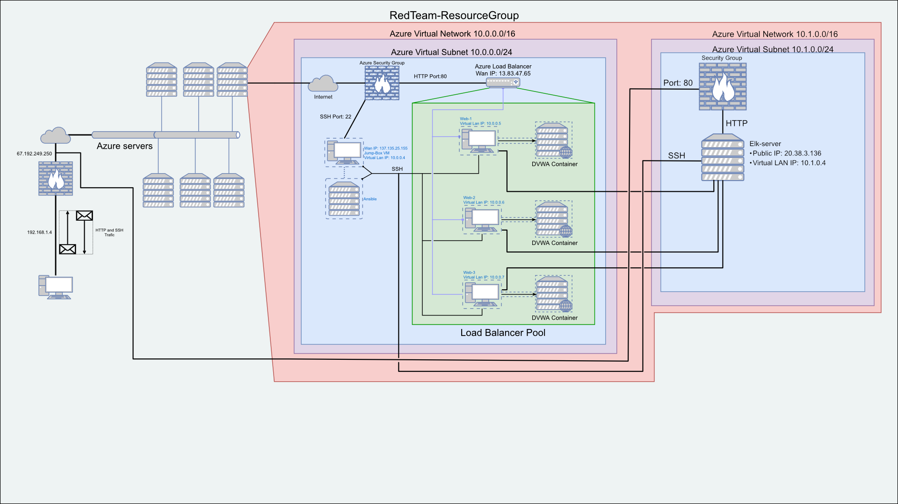
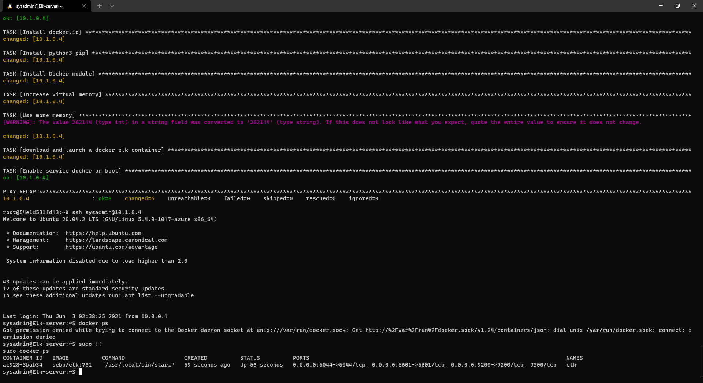

[#playbooks_dir]: Ansible_files/ansible/playbooks

## Automated ELK Stack Deployment

The files in this repository were used to configure the network depicted below.

These files have been tested and used to generate a live ELK deployment on Azure. They can be used to either recreate the entire deployment pictured above. Alternatively, select Ansible playbooks from the [playbooks][#playbooks_dir] directory may be used to install only certain pieces of it, such as [Filebeat](Ansible_files/ansible/playbooks/filebeat-playbook.yml).

This document contains the following details:
- [Description of the Topology](#Description-of-the-Topology)
- [Access Policies](#Access-Policies)
- [ELK Configuration](#Elk-Configuration)
  - [Beats in Use](#Target-Machines-&-Beats)
  - [Machines Being Monitored](#Target-Machines-&-Beats)
- [How to Use the Ansible Build](#Using-the-playbook)

### Description of the Topology

The main purpose of this network is to expose a load-balanced and monitored instance of DVWA, the D*mn Vulnerable Web Application.

Load balancing ensures that the application will be highly efficient, in addition to restricting access to the network.

Integrating an ELK server allows users to easily monitor the vulnerable VMs for changes to the filesystem and system metrics.

The configuration details of each machine may be found below.

|Name|Function|IP Address|Operating System|
|:---:|:---:|:---:|:---:|
|JumpBoxProvisioner|Gateway \| Jumpbox|10.0.0.4|Linux|
|Web-1|Website hosting server 1|10.0.0.5|Linux|
|Web-2|Website hosting server 2|10.0.0.6|Linux|
|Web-3|Website hosting server 3|10.0.0.7|Linux|
|Elk-server|Elk stack|10.1.0.4|Linux|

[#jumpbox]: JumpBoxProvisioner
[#10.0.0.5]: Web-1
[#10.0.0.6]: Web-2
[#10.0.0.7]: Web-3
[#10.1.0.4]: Elk-server

### Access Policies

The machines on the internal network are not exposed to the public Internet.

Only the [jump box][#jumpbox] machine can accept connections from the Internet. Access to this machine is only allowed from the following IP addresses:
- `67.192.249.250`

Machines within the network can only be accessed by the ansible docker container running on the [jump box][#jumpbox].

A summary of the access policies in place can be found in the table below.

| Name     | Publicly Accessible | Allowed IP Addresses To Connect To Inside The Network | Allowed IP Addresses To Connect From Outside The Network|
|:----------:|:---------------------:|:----------------------:|:-:|
|JumpBoxProvisioner|No :x:|[10.0.0.5][#10.0.0.5] [10.0.0.6][#10.0.0.6] [10.0.0.7][#10.0.0.7] [10.1.0.4][#10.1.0.4]|67.192.249.250|
|Elk-server|No :x:|:round_pushpin: TODO: get clarification on what information they want here :triangular_flag_on_post:|:round_pushpin: TODO: get clarification on what information they want here :triangular_flag_on_post:|
|:round_pushpin: TODO: get clarification on what information they want here :triangular_flag_on_post:|:round_pushpin: TODO: get clarification on what information they want here :triangular_flag_on_post:|:round_pushpin: TODO: get clarification on what information they want here :triangular_flag_on_post:|:round_pushpin: TODO: get clarification on what information they want here :triangular_flag_on_post:|

### Elk Configuration

Ansible was used to automate configuration of the ELK machine. No configuration was performed manually, which is advantageous because:
- It is faster due to being able to utilize [playbooks][#playbooks_dir] which set what configurations you would like done so that ansible can preform the configurations simultaneously.
    > or in rappid succession 
- All of the machines will be configured the same
- Easy to redo if need be
- It lowers the chance of making a mistake on one or more machines

The [install-elk playbook](Ansible_files/ansible/playbooks/install-elk.yml) implements the following tasks:
- Install docker.io if not presently installed
- Install pip3 if not presently installed
- Install a docker module using pip
- Increase the virtual memory so that the elk container can run properly
- Download and launch a [specific docker container image](https://hub.docker.com/layers/sebp/elk/761/images/sha256-50e9161f2ad1dbba32bb37ac52b3a729b601e81ebdc12d0e7bc5a6edd3c900ee?context=explore) set up for elk
- Forward or "publish" ports from the docker container to the main VM
- Set the container to always restart if stopped
- Enable the docker service to start on boot

The following screenshot displays the result of running `docker ps` after successfully configuring the ELK instance.

### Target Machines & Beats
This ELK server is configured to monitor the following machines:
- [10.0.0.5][#10.0.0.5]
- [10.0.0.6][#10.0.0.6]
- [10.0.0.7][#10.0.0.7]

We have installed the following Beats on these machines:
- [Filebeat](https://www.elastic.co/beats/filebeat)
- [Metricbeat](https://www.elastic.co/beats/metricbeat)

These Beats allow us to collect the following information from each machine:
- [Filebeat](https://www.elastic.co/beats/filebeat) aggregates `tail -f` and search. Filebeat collects and organizes log files making them easier to search and or filter.
- [Metricbeat](https://www.elastic.co/beats/metricbeat) collects metrics from the system and its services. It then is formated so that it is easy to view and understand when viewing it in Elasticsearch.

### Using the Playbook
In order to use the playbook, you will need to have an Ansible control node already configured. Assuming you have such a control node provisioned: 

SSH into the control node and follow the steps below:
- Copy the wanted playbook files to `/etc/ansible` or if you have a dedicated folder or location for your playbooks `/etc/ansible/{your_playbook_folder_here}`.
- Additionally copy over any wanted configuration files to either `/etc/ansible` or *recommended* a dedicated folder for the files you might want to have copied over into the machines you are configuring i.e. `/etc/ansible/files` or `/etc/ansible/config_files_to_distribute`
- Update the playbook file to include the configuration files and their location, as well as updating the playbook to use your correct hosts group
- Run the playbook, and navigate to each or one of the configured machines IP to check that the installation worked as expected; **or** if deploying an elk stack navigate to either the public IP (*or internal IP <u>if you are on the same network*</u>) of the machine in your web browser with the following url format `000.000.000.000:5601/app/kibana` replacing the `0`'s with IP of the machine that you configured with the playbook

:round_pushpin: TODO: Add either script that walks you through the proccess or further detailed steps that include the commands somewone would need to run to replicate this setup :triangular_flag_on_post: